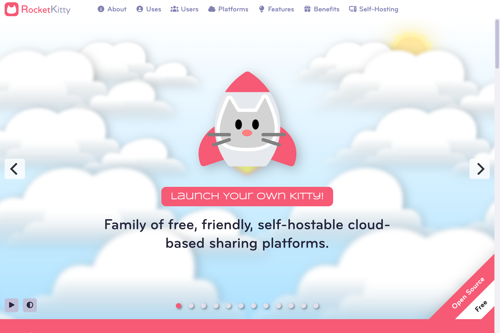

	

# RocketKitty

RocketKitty is a complete family of self-hostable cloud-based data management and sharing platforms, each of which has been optimized for a particular application.

RocketKitty can help you to launch your collection of files, code, music, data - your digital kitty - into the cloud and beyond.

- Free
- Self-hostable
- Easy to use and install
- Platform independent
- Secure

Welcome Screen

## Which RocketKitty Is Right For You?

- If you would like to manage and share files and messages, use [DataKitty](https://github.com/RocketKitties/DataKitty).
- If you are a photographer and want to manage and share your photos, use [PhotoKitty](https://github.com/RocketKitties/PhotoKitty).
- If you mainly want to communicate with friends, family or colleagues, use [ChatKitty](https://github.com/RocketKitties/ChatKitty).
- If you need to manage geolocated data, like aerial drone photos, use [MapKitty](https://github.com/RocketKitties/MapKitty).
- If you want to manage and play music, podcasts, or audio, use [MusicKitty](https://github.com/RocketKitties/MusicKitty).
- If you are a software developer and want to manage your source code, use [SourceKitty](https://github.com/RocketKitties/SourceKitty).
- If you just want to manage your files and don't need the ability to exchange messages, use [FileKitty](https://github.com/RocketKitties/FileKitty).
- If you want to experiment with AI generated images, use [DreamKitty](https://github.com/RocketKitties/DreamKitty).
- If you want to access data in S3 buckets, use [S3Kitty](https://github.com/RocketKitties/S3Kitty).

 

	<a href="https://github.com/RocketKitties/ChatKitty">
		
		<b>ChatKitty</b>
	</a>
	
ChatKitty enables you to chat by discussion topic or by direct message so you can keep in touch with your friends, family, or colleagues. Exchange messages, news, files, documents, folders, images, code, music, and more.

	<a href="https://github.com/RocketKitties/MapKitty">
		
		<b>MapKitty</b>
	</a>
	
MapKitty is a cloud-based geospatial image and data storage, management, and sharing system. Best of all, you can run it on your own server.

	<a href="https://github.com/RocketKitties/DataKitty">
		
		<b>DataKitty</b>
	</a>
	
DataKitty is a cloud-based file storage, management, and sharing system. DataKitty makes sharing your data simple. Best of all, you can run it on your own server.

	<a href="https://github.com/RocketKitties/PhotoKitty">
		
		<b>PhotoKitty</b>
	</a>
	
PhotoKitty is a cloud-based photo management and sharing system that makes organizing and sharing your photos easy. Best of all, you can run on your own server!

	<a href="https://github.com/RocketKitties/SourceKitty">
		
		<b>SourceKitty</b>
	</a>
	
SourceKitty is a cloud-based code storage, management, and sharing system. Best of all, you can run it on your own server!

	<a href="https://github.com/RocketKitties/FileKitty">
		
		<b>FileKitty</b>
	</a>
	
FileKitty is a cloud-based file storage, management, and sharing system. FileKitty makes file sharing easy. Best of all, you can run it on your own server.

	<a href="https://github.com/RocketKitties/S3Kitty">
		
		<b>S3Kitty</b>
	</a>
	
S3Kitty is a cloud-based web interface for managing S3 data. It combines the capacity of S3 with the familiar look and feel of your desktop or mobile OS. Best of all, you can run it on your own server.

	<a href="https://github.com/RocketKitties/DreamKitty">
		
		<b>DreamKitty</b>
	</a>
	
DreamKitty is a cloud-based AI image generation platform. Using simple text prompts, you can visualize and share virtually anything that you can dream of.

	<a href="https://github.com/RocketKitties/MusicKitty">
		
		<b>MusicKitty</b>
	</a>
	
MusicKitty is a cloud-based audio storage, management, and sharing system. You love your music. Now you can love your music platform. Best of all, you can run it on your own server.

## License

Distributed under the <a href="https://indiesource.org/">IndieSource License</a> which allows unrestricted use of the software except by very large corporations. See [LICENSE.md](LICENSE.md) for more information.

## Contact

mailto:admin@rocketkitty.org
